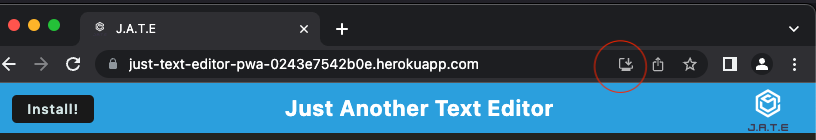

[](https://opensource.org/licenses/MIT)    


# Text Editor PWA (progressive web applications)

--- 
The `Text Editor PWA` was created as part of Berkeley Coding Bootcamp Challenge 19 to fulfill the requirements of a Progressive Web App (PWA).
- Deployed application can be accessed in the [Heroku](https://just-text-editor-pwa-0243e7542b0e.herokuapp.com/) cloud platform.
- The walk-through video showcasing the operation of the Text Editor PWA application can be located in the [Walk-through Video](#walk-through-video) section. Alternatively, you can access the video through cloud storage by following this  [link](https://1drv.ms/v/s!Ak2qWe8ZT6ny3GlW0Omvwxb8blK4?e=vgqx7p).

---
## Table of Contents
* [General Information](#general-information)
* [Walk-through Video](#walk-through-video)
* [Technologies Used](#technologies-used)
* [Installation](#installation)
* [Usage](#usage)
* [Features](#features)
* [User Story](#user-story)
* [Acceptance Criteria](#acceptance-criteria)
* [Contact](#contact)
* [Project Status](#project-status)
* [License](#license)

---
## General Information 
The Text Editor, which can be installed as a Progressive Web Application, empowers users to save their thoughts while on the go, even in offline mode, by preloading the source code into the browser. Moreover, it integrates multiple data persistence techniques like local storage and indexDB to provide redundancy in case any of these options are unsupported by the browser. The development of the application was done accordingly to [user story](#user-story) and [acceptance criteria](#acceptance-criteria). 

---
## Walk-through Video 
https://github.com/UserOlena/text_editor_progressive_web_applications/assets/122197592/edfca061-bcf1-4ff5-85c6-e3f366fef451

---
## Technologies Used
-  [javaScript](https://developer.mozilla.org/en-US/docs/Learn/JavaScript/First_steps/What_is_JavaScript) - A programming language for web development and scripting.
-  [node.js v18.16.0](https://nodejs.org/en) -  A scalable server-side JavaScript runtime.
-  [exspress v4.17.1](https://www.npmjs.com/package/express) - Web application framework for building server-side applications.
- [concurrently v5.2.0](https://www.npmjs.com/package/concurrently) - Package for managing and executing JavaScript tasks in parallel.
- [code-mirror-themes v1.0.0](https://www.npmjs.com/package/code-mirror-themes) - Collection of themes for the CodeMirror text editor.
- [@babel/core v7.15.0](https://www.npmjs.com/package/@babel/core) - Compiler for transforming modern JavaScript into backward-compatible versions.
- [@babel/plugin-transform-runtime v7.15.0](https://www.npmjs.com/package/@babel/plugin-transform-runtime) - Babel plugin for transforming code to use the runtime features.
- [@babel/preset-env v7.15.0](https://www.npmjs.com/package/@babel/preset-env) - Babel preset for automatically configuring environment-specific language transformations.
- [@babel/runtime v7.15.3](https://www.npmjs.com/package/@babel/runtime) - Babel runtime library providing helper functions for transformed code.
- [babel-loader v8.2.2](https://www.npmjs.com/package/babel-loader) - Webpack loader for transpiling JavaScript code using Babel.
- [@babel/plugin-proposal-object-rest-spread v7.20.7](https://www.npmjs.com/package/@babel/plugin-proposal-object-rest-spread) - Babel plugin for enabling object rest/spread syntax proposals in JavaScript.
- [css-loader v6.2.0](https://www.npmjs.com/package/css-loader) - Webpack loader for importing CSS files and resolving CSS dependencies.
- [html-webpack-plugin v5.3.2](https://www.npmjs.com/package/html-webpack-plugin) - Webpack plugin for generating HTML files with bundled assets automatically.
- [http-server 0.11.1](https://www.npmjs.com/package/http-server) - Command-line utility for running a simple HTTP server for static files.
- [idb v6.1.2](https://www.npmjs.com/package/idb) - IndexedDB, a client-side database for storing structured data in web browsers.
- [style-loader v3.2.1](https://www.npmjs.com/package/style-loader) - Webpack loader for injecting CSS styles into the DOM at runtime
- [webpack v5.51.1](https://webpack.js.org/) - Module bundler for JavaScript applications that transforms and bundles assets.
- [webpack-cli v4.8.0](https://www.npmjs.com/package/webpack-cli) - Command-line interface for configuring and running webpack builds.
- [webpack-dev-server v4.0.0](https://www.npmjs.com/package/webpack-dev-server) - Development server for webpack that provides live reloading and hot module replacement.
- [webpack-pwa-manifest v4.3.0](https://www.npmjs.com/package/webpack-pwa-manifest) - Webpack plugin for generating a Progressive Web App (PWA) manifest file.
- [workbox-webpack-plugin v6.2.4](https://www.npmjs.com/package/workbox-webpack-plugin) - Webpack plugin for generating a service worker using Workbox.

---
## Installation
Deployed application can be accessed in the [Heroku](https://just-text-editor-pwa-0243e7542b0e.herokuapp.com/) cloud platform.

### To perform a local installation, please follow these steps:

**Prerequisites**

- [node.js v18.16.0](https://nodejs.org/en/) - It is recommended to download `node.js v18.16.0` since this application has only been tested with that version. 
- [Google Chrome](https://www.google.com/) - Web browser developed by Google.

**Local Installation**

To use the `Text Editor PWA`, the user needs to complete the following steps: 

1. Clone the repository:
  - Go to the [Git-Hub](https://github.com/UserOlena/text_editor_progressive_web_applications)
  - Clone the repository to your local computer.
2. Navigate to the Text Editor PWA directory:
  - Open a command line interface (e.g., Terminal).
  - Change directory to the Text Editor PWA repository location. Use the command `cd ~/...` and replace `...` with the path to the Text Editor PWA directory.
3. Initialize [node.js](https://nodejs.org/en) modules:
  - In the command line, while in the Text Editor PWA root directory, run the command `npm i`.
  - This command will install the required Node.js modules for the application to function.
4. Start the application:
  - In the command line, type `npm start` to bundle the static files and start the server.
5. Open application in the browser:
  - Open [Google Chrome](https://www.google.com/) browser to use the applicatin. 
  - Include the `localhost:3000` URL in a dedicated section of the browser.
  - The application should now be up and running.

These steps should guide you through the process of setting up and running the Text Editor PWA successfully.

---
## Usage
- To utilize deployed version of the Text Editor PWA, simply go to the [Heroku](https://just-text-editor-pwa-0243e7542b0e.herokuapp.com/) cloud platform.
- The Text editor Progressive Web Application (PWA) offers a highly user-friendly experience. Users have the freedom to type their thoughts without any restrictions, and as soon as the editor loses focus, the entered data is automatically saved to both the browser's local storage and the indexedDB. This ensures that users can seamlessly resume their work and have their data securely stored across sessions and retrieve saved data after reopening the app. Additionally, users can retrieve their saved data after reopening the app, further enhancing the convenience of the Text editor PWA.
- To install the Text Editor PWA as an application, you can simply click on the "install" button shown in the screenshot. This action will prompt the application to be installed on your machine, and an associated desktop icon will be created for easy access.

Installation Button:



Desktop Icon:


---
## Features
* Uses IndexedDB to create an object store and includes both GET and PUT methods

* The application works without an internet connection

* Automatically saves content inside the text editor when the DOM window is unfocused

* Bundled with webpack

* Create a service worker with workbox that Caches static assets

* The application uses babel in order to use async / await

* Application have a generated `manifest.json` using the `WebpackPwaManifest` plug-in

* Can be installed as a Progressive Web Application

---
## User Story
```md
AS A developer
I WANT to create notes or code snippets with or without an internet connection
SO THAT I can reliably retrieve them for later use
```  

---
## Acceptance Criteria
```md
GIVEN a text editor web application
WHEN I open my application in my editor
THEN I should see a client server folder structure
WHEN I run `npm run start` from the root directory
THEN I find that my application should start up the backend and serve the client
WHEN I run the text editor application from my terminal
THEN I find that my JavaScript files have been bundled using webpack
WHEN I run my webpack plugins
THEN I find that I have a generated HTML file, service worker, and a manifest file
WHEN I use next-gen JavaScript in my application
THEN I find that the text editor still functions in the browser without errors
WHEN I open the text editor
THEN I find that IndexedDB has immediately created a database storage
WHEN I enter content and subsequently click off of the DOM window
THEN I find that the content in the text editor has been saved with IndexedDB
WHEN I reopen the text editor after closing it
THEN I find that the content in the text editor has been retrieved from our IndexedDB
WHEN I click on the Install button
THEN I download my web application as an icon on my desktop
WHEN I load my web application
THEN I should have a registered service worker using workbox
WHEN I register a service worker
THEN I should have my static assets pre cached upon loading along with subsequent pages and static assets
WHEN I deploy to Heroku
THEN I should have proper build scripts for a webpack application
```

---
## Contact
-  [Olena P](https://github.com/UserOlena)
    
---
## Project Status 
- Project is: Complete 

---
## License
- This project is open source and available under the [MIT](./LICENSE)
